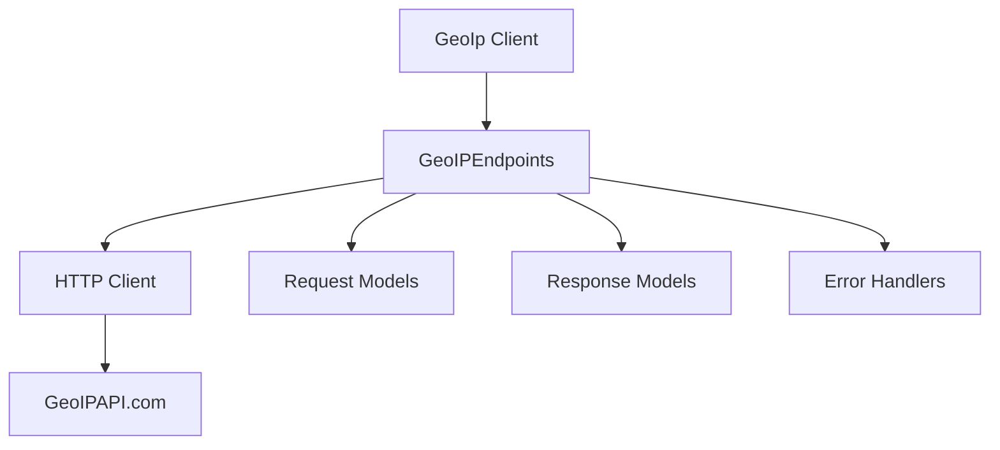

<div align="center">
  <h1>GeoIP Java SDK</h1>
  <a href="https://mit-license.org/">
    
  </a>
  
  
</div>

**Enterprise-grade IP Geolocation API client for Java applications**

A high-performance, type-safe Java SDK for GeoIPAPI.com that provides real-time IP geolocation data for personalization, analytics, and security applications. Built with developer experience in mind.

---

## 📋 Table of Contents

- [🌍 GeoIP Java SDK](#-geoip-java-sdk)
  - [📋 Table of Contents](#-table-of-contents)
  - [✨ Features](#-features)
  - [🚀 Quick Start](#-quick-start)
  - [📦 Installation](#-installation)
  - [💡 Usage Examples](#-usage-examples)
  - [📁 Project Structure](#-project-structure)
  - [⚙️ Configuration](#️-configuration)
  - [🧪 Testing](#-testing)
  - [🏗️ Architecture](#️-architecture)
  - [🤝 Contributing](#-contributing)
  - [📄 License](#-license)
  - [🙏 Acknowledgements](#-acknowledgements)

## ✨ Features

- 🎯 **Type-Safe**: Fully typed responses with compile-time safety
- ⚡ **High Performance**: Optimized for enterprise-scale applications
- 🌐 **Multiple Formats**: Support for JSON, JSONP, XML, and YAML responses
- 🔒 **Secure**: Built-in security best practices and error handling
- 📱 **Easy Integration**: Simple, intuitive API design
- 🛡️ **Enterprise Ready**: Production-ready with comprehensive error handling
- 📖 **Well Documented**: Extensive documentation and examples

## 🚀 Quick Start

```java
import org.openapis.openapi.GeoIp;
import org.openapis.openapi.models.operations.GetIpResponse;

// Initialize the SDK
GeoIp client = GeoIp.builder().build();

// Get current IP address
GetIpResponse response = client.geoIPEndpoints().getIp().call();

if (response.res().isPresent()) {
    System.out.println("Current IP: " + response.res().get());
}
```

## 📦 Installation

### Requirements

- **Java 11** or later
- **Gradle** 6.0+ or **Maven** 3.6+

### Gradle

Add to your `build.gradle`:

```groovy
implementation 'org.geoipapi:geoip:0.0.1'
```

### Maven

Add to your `pom.xml`:

```xml
<dependency>
    <groupId>org.geoipapi</groupId>
    <artifactId>geoip</artifactId>
    <version>0.0.1</version>
</dependency>
```

### Building from Source

Clone the repository and build:

```bash
git clone https://github.com/geoipapi/geo-ip-java.git
cd geo-ip-java

# Unix/Linux/macOS
./gradlew build

# Windows
gradlew.bat build
```

To publish to your local Maven repository:

```bash
# Unix/Linux/macOS
./gradlew publishToMavenLocal -Pskip.signing

# Windows
gradlew.bat publishToMavenLocal -Pskip.signing
```

## 💡 Usage Examples

### Basic IP Geolocation

```java
import org.openapis.openapi.GeoIp;
import org.openapis.openapi.models.operations.GetIpDataResponse;

public class GeoLocationExample {
    public static void main(String[] args) {
        GeoIp sdk = GeoIp.builder()
            .serverURL("https://api.geoipapi.com")
            .build();

        try {
            // Get detailed geolocation data
            GetIpDataResponse response = sdk.geoIPEndpoints()
                .getIpData()
                .call();

            if (response.responseGetJsonDataJsonGet().isPresent()) {
                var geoData = response.responseGetJsonDataJsonGet().get();
                System.out.println("Location data retrieved successfully!");
                // Process geolocation data
            }
        } catch (Exception e) {
            System.err.println("Error retrieving geolocation data: " + e.getMessage());
        }
    }
}
```

### Error Handling

```java
import org.openapis.openapi.models.errors.HTTPValidationError;

try {
    GetIpDataResponse response = sdk.geoIPEndpoints().getIpData().call();
    // Handle successful response
} catch (HTTPValidationError e) {
    // Handle validation errors (422)
    System.err.println("Validation error: " + e.getMessage());
} catch (Exception e) {
    // Handle other API errors
    System.err.println("API error: " + e.getMessage());
}
```

### Custom Server Configuration

```java
GeoIp sdk = GeoIp.builder()
    .serverURL("https://custom-api-endpoint.com")
    .build();
```

## 📁 Project Structure

```
geo-ip-java/
├── src/
│   ├── main/java/
│   │   └── org/openapis/openapi/
│   │       ├── GeoIp.java              # Main SDK client
│   │       ├── models/                 # Data models and DTOs
│   │       │   ├── operations/         # Request/response models
│   │       │   └── errors/             # Error handling models
│   │       └── utils/                  # Utility classes
│   └── test/java/                      # Test files
├── docs/                               # API documentation
├── build.gradle                        # Gradle build configuration
├── settings.gradle                     # Gradle settings
└── README.md                          # This file
```

### Key Components

- **`GeoIp.java`** - Main SDK client class and entry point
- **`models/operations/`** - Request and response models for API operations
- **`models/errors/`** - Exception classes for error handling
- **`docs/`** - Detailed API documentation and examples

## ⚙️ Configuration

### Environment Variables

Currently, no environment variables are required for basic usage. The SDK uses sensible defaults.

### Logging Configuration

Enable debug logging for development:

```java
// Enable request/response logging (development only)
SpeakeasyHTTPClient.setDebugLogging(true);
```

**⚠️ Warning**: Only use debug logging in development. It may expose sensitive information in production logs.

### Custom Headers

Redact sensitive headers from logs:

```java
SpeakeasyHTTPClient.setRedactedHeaders(Arrays.asList("Authorization", "X-API-Key"));
```

## 🧪 Testing

Run the test suite:

```bash
# Run all tests
./gradlew test

# Run tests with coverage
./gradlew test jacocoTestReport

# Run specific test class
./gradlew test --tests "GeoIpTest"
```

Test results will be available in `build/reports/tests/test/index.html`.

## 🏗️ Architecture

### Core Components



### Design Principles

- **Type Safety**: All API responses are strongly typed
- **Immutability**: Response objects are immutable by design
- **Error Handling**: Comprehensive exception hierarchy
- **Performance**: Optimized HTTP client with connection pooling
- **Extensibility**: Builder pattern for easy configuration

## 🤝 Contributing

We welcome contributions! Here's how to get started:

1. **Fork** the repository
2. **Create** a feature branch (`git checkout -b feature/amazing-feature`)
3. **Commit** your changes (`git commit -m 'Add amazing feature'`)
4. **Push** to the branch (`git push origin feature/amazing-feature`)
5. **Open** a Pull Request

### Development Guidelines

- Follow Java naming conventions
- Write comprehensive tests for new features
- Update documentation for API changes
- Ensure all tests pass before submitting PR

### Code Style

This project follows standard Java coding conventions. Please ensure your code:

- Uses proper indentation (4 spaces)
- Includes JavaDoc comments for public methods
- Follows camelCase naming conventions
- Includes appropriate error handling

## 📄 License

This project is licensed under the MIT License - see the [LICENSE](LICENSE) file for details.

## 🙏 Acknowledgements

- **GeoIPAPI.com** - For providing the excellent IP geolocation service
- **Java Community** - For the robust ecosystem and tools
- **Contributors** - Thank you to all who have contributed to this project

---

<div align="center">
  <strong>Ready to get started?</strong><br>
  <a href="#-quick-start">Try the Quick Start Guide</a> •
  <a href="docs/">Read the Docs</a> •
  <a href="https://github.com/geoipapi/geo-ip-java/issues">Report Issues</a>
</div>

<div align="center">
  <sub>Built with ❤️ for the Java community</sub>
</div>
